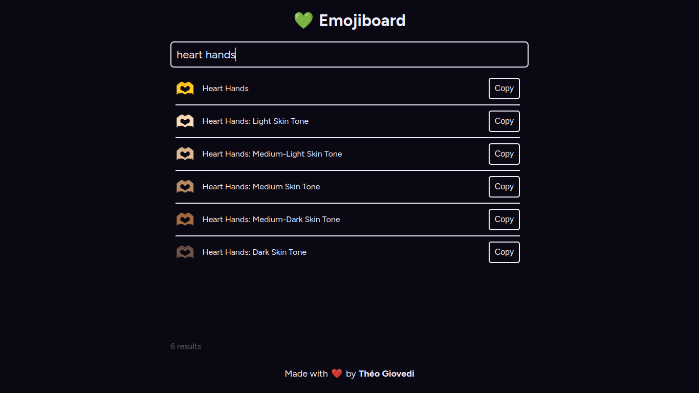

# ⌨️ Emojiboard

The efficient online emoji picker

## ⭐ Features

- 🧑‍💻 Keyboard-driven
- ⚡ Fast & efficient
- 🕵️ Search with regular expressions

## 🎁 Installation

1. Clone the repo: `git clone https://github.com/theogiovedi/emojiboard`
2. Go to repo folder: `cd emojiboard`
3. Install dependencies: `npm install`
4. Run the test server: `npx next dev`

## 📃 License

MIT License